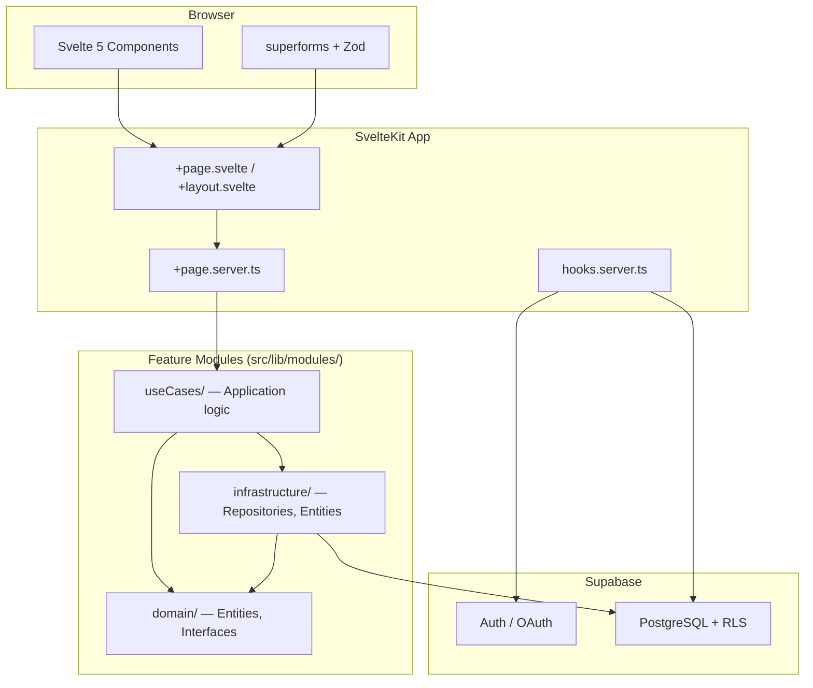

# Svelte Supabase Starter Template

A production-ready SvelteKit starter template with Supabase backend, clean architecture, and shift-left quality practices.

## Architecture Overview



## Documentation

| Document                                             | Description                                            |
| ---------------------------------------------------- | ------------------------------------------------------ |
| [Architecture Overview](./01_ARCHITECTURE.md)        | Detailed architecture and design patterns              |
| [Svelte Standards](./02_SVELTE-STANDARDS.md)         | Svelte 5 patterns, SOLID principles, and form handling |
| [Routing & Pages](./03_ROUTING-PAGES.md)             | File-based routing and page patterns                   |
| [Supabase Guide](./04_SUPABASE-GUIDE.md)             | Database integration and clean architecture layers     |
| [Testing Guide](./05_TESTING.md)                     | E2E testing with Playwright and V8 coverage            |
| [UI Components](./06_UI-COMPONENTS.md)               | Component architecture and styling system              |
| [TypeScript Standards](./07_TYPESCRIPT-STANDARDS.md) | TypeScript conventions and coding rules                |

## Scripts

| Script                          | Description                         |
| ------------------------------- | ----------------------------------- |
| `pnpm dev`                      | Start development server            |
| `pnpm build`                    | Build production bundle             |
| `pnpm preview`                  | Preview production build locally    |
| `pnpm check`                    | TypeScript type checking            |
| `pnpm check:watch`              | Type checking in watch mode         |
| `pnpm format`                   | Format with Prettier                |
| `pnpm lint`                     | Prettier check + ESLint             |
| `pnpm test`                     | Run Playwright E2E tests            |
| `pnpm test:show-report`         | Open Monocart HTML report           |
| `pnpm coverage:show-report`     | Open V8 coverage report             |
| `pnpm supabase:gen-types`       | Generate types from remote Supabase |
| `pnpm supabase:gen-types:local` | Generate types from local Supabase  |

## Path Aliases

| Alias           | Path                   | Purpose                |
| --------------- | ---------------------- | ---------------------- |
| `$lib`          | `src/lib`              | Base library alias     |
| `$components/*` | `src/lib/components/*` | Reusable UI components |
| `$modules/*`    | `src/lib/modules/*`    | Feature modules        |

## Technology Stack

**Core:** SvelteKit 2, Svelte 5 (Runes), TypeScript (strict), Vite

**Backend:** Supabase (Postgres + RLS), `@supabase/ssr`, Drizzle ORM

**UI:** Tailwind CSS v4, Bits UI, Tailwind Variants, Lucide Svelte

**Forms:** Zod v4, sveltekit-superforms

**Quality:** ESLint, Prettier, Playwright, Monocart Reporter, Husky, lint-staged

**Observability:** Sentry

## Quality Gates

| Stage      | Trigger         | Actions                                 |
| ---------- | --------------- | --------------------------------------- |
| Pre-commit | `git commit`    | Prettier + ESLint on staged files       |
| Pre-push   | `git push`      | Full Playwright E2E suite with coverage |
| CI/CD      | Push/PR to main | Lint, type-check, test, build           |
| Runtime    | Production      | Sentry error tracking                   |

## Environment Variables

Copy `.env.dist` to `.env`:

```
PUBLIC_SUPABASE_URL=your-supabase-project-url
PUBLIC_SUPABASE_ANON_KEY=your-supabase-anon-key
VITE_API_BASE_URL=your-base-api
VITE_SENTRY_DSN=your-sentry-dsn
SENTRY_DSN=your-sentry-dsn
SENTRY_ORG=your-sentry-org
SENTRY_PROJECT=your-sentry-project
SENTRY_AUTH_TOKEN=your-sentry-auth-token
```
