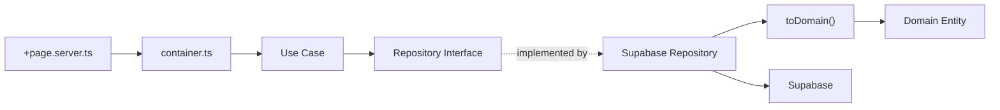
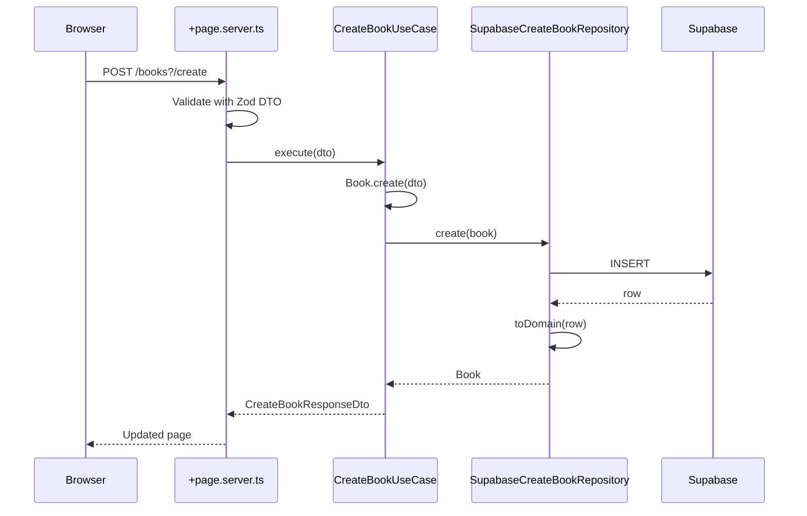

# Architecture Overview

## Module-Based Clean Architecture

Each feature lives in `src/lib/modules/{feature}/` with three layers:

```
src/lib/modules/
├── books/
│   ├── books.container.ts        # DI wiring — instantiates use cases
│   ├── domain/
│   │   ├── Book.ts               # Domain entity class + interfaces
│   │   └── errors.ts             # Domain-specific errors
│   ├── useCases/
│   │   ├── create-book/          # One folder per use case
│   │   │   ├── create-book.use-case.ts
│   │   │   ├── create-book.repository.interface.ts
│   │   │   ├── create-book.request.dto.ts
│   │   │   └── create-book.response.dto.ts
│   │   └── update-book/
│   │       ├── update-book.use-case.ts
│   │       ├── update-book.repository.interface.ts
│   │       └── update-book.request.dto.ts
│   └── infrastructure/
│       ├── entities/
│       │   └── book.entity.ts    # DB row type alias (from Database type)
│       └── repositories/
│           ├── supabase-create-book.repository.ts
│           └── supabase-update-book.repository.ts
└── shared/
    ├── domain/                   # Cross-cutting types (database.types.ts)
    └── infrastructure/           # Cross-cutting infra (auth)
```

## Layer Responsibilities

| Layer              | Location                 | Responsibility                                          |
| ------------------ | ------------------------ | ------------------------------------------------------- |
| **Domain**         | `domain/`                | Entity classes with business rules, no framework deps   |
| **Use Cases**      | `useCases/{use-case}/`   | Application logic, one class per use case               |
| **Infrastructure** | `infrastructure/`        | Supabase repos with `toDomain` mappers, DB entity types |
| **Container**      | `{feature}.container.ts` | Wires use cases with concrete repositories              |
| **Route**          | `src/routes/`            | SvelteKit load functions and form actions               |

## Dependency Rules

- Domain has **zero** external imports — no Supabase, no SvelteKit
- Use Cases depend on repository **interfaces**, never concrete implementations
- Repository interfaces live in `useCases/{use-case}/` alongside the use case
- Infrastructure depends on Domain (for entity classes) and `shared/domain/` (for DB types)
- Routes import only the container function — never repositories or use cases directly



## Dependency Injection

The Supabase client is created per-request in `hooks.server.ts` and passed to the container in `+page.server.ts`:

```ts
// +page.server.ts
import { createBooksContainer } from '$modules/books/books.container';

const { create } = createBooksContainer(locals.supabase);
await create.execute(dto);
```

The container wires everything:

```ts
// books.container.ts
export function createBooksContainer(supabase: SupabaseClient<Database>) {
  return {
    create: new CreateBookUseCase(new SupabaseCreateBookRepository(supabase)),
    update: new UpdateBookUseCase(new SupabaseUpdateBookRepository(supabase))
  };
}
```

## Request Flow: Create a Book


